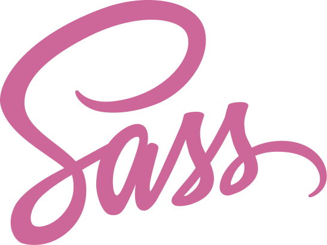

<h1 align="left">Erreur De Syntaxe (aka Syntax Error)</h1>

<h2 align="left">About me</h2>

My name is Xavier. I am currently learning web development through <a href="https://www.theodinproject.com/paths/full-stack-javascript">The Odin Project</a> in the Full Stack JavaScript path and supplementing my studies with <a href='https://www.udemy.com/'>Udemy courses</a>.

<h2 align="left">Languages and Tools:</h2>

